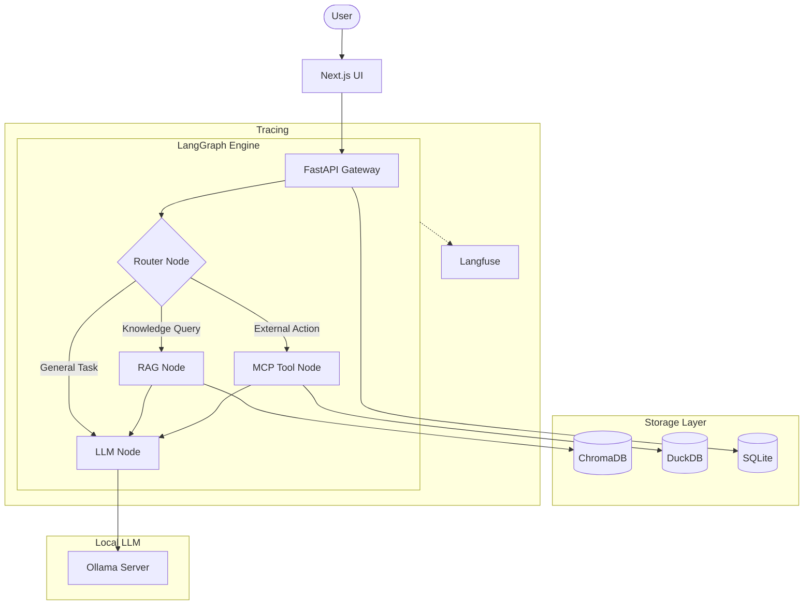

# 🏗️ Architecture & Design

This document outlines the high-level architecture of the Production AI system.

## 🔄 System Flow

The system operates as a unified intelligence gateway, routing user requests through specialized agents and tools.

## 🧠 Core Components

### 1. LLM Layer (Ollama)
We utilize **Ollama** for local inference. This ensures data privacy and eliminates API costs.
- **Gemma 3**: Primary reasoning and instruction following.
- **Llama 3.3**: High-performance alternative for complex tasks.
- **Nomic-Embed-Text**: Specialized model for high-quality RAG embeddings.

### 2. Orchestration (LangGraph)
Unlike linear chains, **LangGraph** allows for stateful, cyclic graphs.
- **Router**: Analyzes intent (RAG vs. Tools vs. Direct).
- **Persistence**: Remembers conversation state across sessions using a SQL checkpointer.

### 3. RAG Pipeline (LlamaIndex)
We use **LlamaIndex** for advanced retrieval strategies:
- **Small-to-Big Retrieval**: Fetching specific chunks but providing surrounding context.
- **Metadata Filtering**: Scoping searches based on user attributes or timestamps.

### 4. Tool Layer (MCP)
The **Model Context Protocol (MCP)** provides a standardized way to connect agents to:
- **Local Databases**: Querying DuckDB for analytics.
- **Filesystem**: Reading and writing project files.
- **Browser**: Real-time web search or interaction.

### 5. Observability
Every interaction is traced using **Langfuse**. This provides:
- Detailed cost/latency breakdowns (even though cost is $0, latency is tracked).
- Prompt versioning and testing.
- Human-in-the-loop feedback loops.
